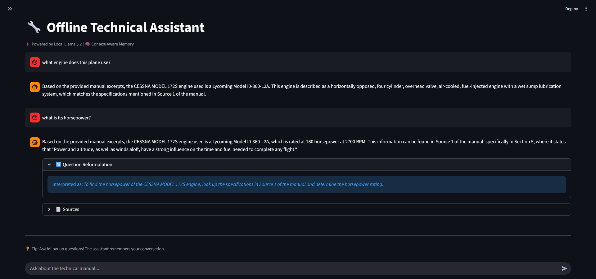

# Secure Air-Gapped Technical Manual Assistant

A fully offline RAG (Retrieval Augmented Generation) chatbot designed for secure environments where internet connectivity is restricted or prohibited. Built to demonstrate practical AI deployment in defense and aerospace contexts.

## Key Features

- **Completely Offline**: No API calls, no cloud services, no data leaves your machine
- **Conversational Memory**: Understands follow-up questions using a custom context-aware memory system
- **Optimized for Edge Devices**: Uses `llama3.2:1b` model that runs efficiently on standard hardware
- **Document Intelligence**: Retrieves relevant manual sections before generating responses
- **Real-World Testing**: Validated using Cessna 172 Pilot Operating Handbook

## Architecture

```
User Query → Streamlit Interface → Ollama (Local LLM)
                                         ↓
                                   Vector Database
                                   (nomic-embed-text)
                                         ↓
                              Retrieved Context + Query
                                         ↓
                                Response Generation
```

The system embeds technical documents locally, stores them in a vector database, and retrieves relevant sections when answering questions—all without internet access.

## Technical Stack

| Component | Technology | Rationale |
|-----------|------------|-----------|
| **Language** | Python 3.12 | Industry standard for AI/ML applications |
| **UI Framework** | Streamlit | Rapid prototyping, minimal overhead |
| **LLM Runtime** | Ollama | Local model hosting with simple API |
| **Language Model** | llama3.2:1b | Small footprint for edge deployment |
| **Embeddings** | nomic-embed-text | Efficient local semantic search |

## Installation

### Prerequisites
- Python 3.12+
- [Ollama](https://ollama.ai) installed and running
- 8GB+ RAM recommended

### Setup

1. **Clone the repository**
```bash
git clone https://github.com/asperavl/manual-rag-analysis
cd manual-rag-analysis
```

2. **Install dependencies**
```bash
pip install -r requirements.txt
```

3. **Pull required Ollama models**
```bash
ollama pull llama3.2:1b
ollama pull nomic-embed-text
```

4. **Run the application**
```bash
streamlit run app.py
```

## Usage

1. Upload a technical manual (PDF format)
2. Wait for document processing and embedding
3. Ask questions in natural language
4. System maintains conversation context for follow-ups

**Example Queries:**
- "What is the maximum takeoff weight?"
- "What about with full fuel?" (context-aware follow-up)
- "Show me the emergency procedures for engine failure"

## Screenshots

### Context-Aware Conversation

*The system understands follow-up questions without needing to repeat context*

## Security Considerations

- **Air-gapped Compatible**: Designed for environments with no internet access
- **No Telemetry**: Zero data transmission to external services
- **Local Processing**: All computation happens on-premises
- **Audit Trail**: Can be extended to log all queries for compliance

## Performance Metrics

- **Response Time**: ~2-5 seconds on consumer hardware
- **Memory Footprint**: ~2GB RAM during operation
- **Model Size**: 1.3GB (llama3.2:1b)
- **Embedding Speed**: ~500 tokens/second

## Use Cases

- Aircraft maintenance technicians querying POH/maintenance manuals
- Field engineers accessing equipment documentation offline
- Classified facility operations requiring air-gapped systems
- Training environments without reliable connectivity

## Future Enhancements

- [ ] Multi-document support (cross-reference multiple manuals)
- [ ] Citation tracking (show exact page/section for each answer)
- [ ] Export conversation logs for compliance
- [ ] Fine-tuning on domain-specific technical language
- [ ] Batch processing for large document libraries
